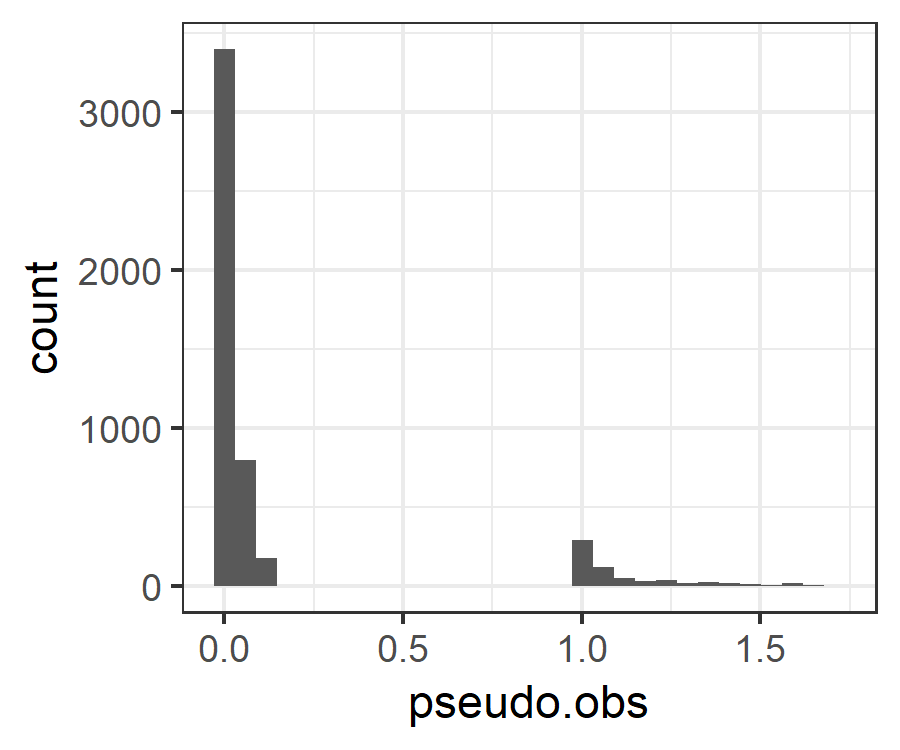
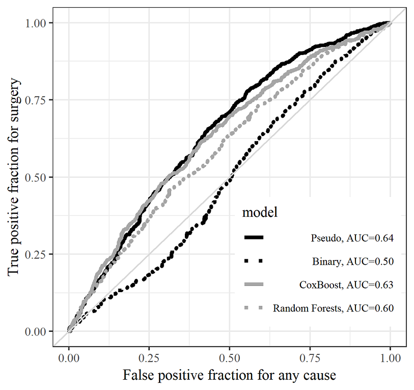
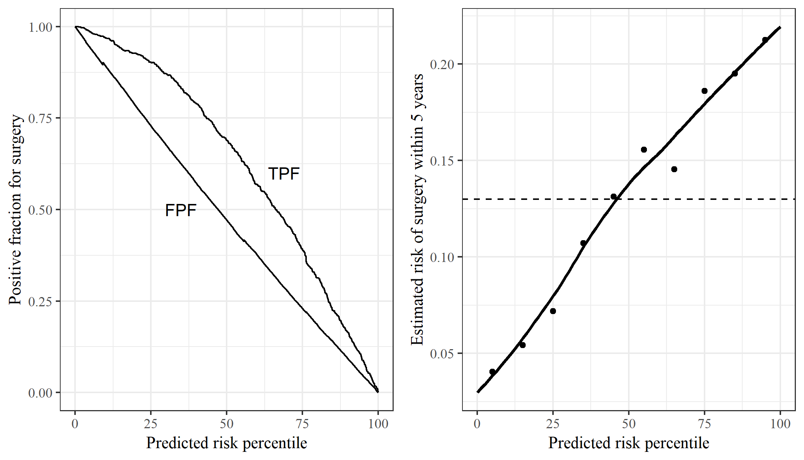

```{r setup, include=FALSE}
options(htmltools.dir.version = FALSE)
knitr::opts_chunk$set(echo = FALSE, message = FALSE, warning = FALSE, 
                      fig.width = 10, fig.height = 10 * .618,
                      fig.align = 'center')
library(ggplot2)
library(gridExtra)
library(plotROC)
library(dplyr)
library(igraph)


theme_set(theme_bw())# + theme(plot.background = element_rect(fill = "#999999")))

```


class: inverse, center, middle

# Introduction

How do we incorporate predictions into decision making?

---

# A simple decision tree

```{r, fig.width = 9, fig.height = 5}
G <- graph.tree(n=7,children=2)

#add names to vertex (just assign a upper-case letter to each)
V(G)$name <- c("Home", "Outside", "Outside", "dry and burden", "dry and burden", "wet and no burden", "dry and no burden")
E(G)$name <- c("raincoat", "no raincoat", "rain", "no rain", "rain", "no rain")

# plot (1)
lay <- layout.reingold.tilford(G, params=list(root='Home')) 
par(mar = c(0, 0, 0, 0) + .1)
plot(G, layout=-lay[, 2:1], vertex.shape="none", edge.label = E(G)$name, edge.label.color = "black", cex = .85)
```

---

# Incorporating probabilities and utilities

```{r,  fig.width = 9, fig.height = 5}
G <- graph.tree(n=7,children=2)

#add names to vertex (just assign a upper-case letter to each)
V(G)$name <- c("Home", "Outside", "Outside", "dry and burden (-10)", "dry and burden (-10)", "wet and no burden (-100)", "dry and no burden (0)")
E(G)$name <- c("raincoat (Pr=0.5)", "no raincoat (Pr=0.5)", "rain (0.5)", "no rain (0.5)", "rain (0.5)", "no rain (0.5)")

# plot (1)
lay <- layout.reingold.tilford(G, params=list(root='Home')) 
par(mar = c(0, 0, 0, 0) + .1)
plot(G, layout=-lay[, 2:1], vertex.shape="none", edge.label = E(G)$name, edge.label.color = "black", cex = .85)

```
---


# Incorporating a prediction

```{r util2, fig.width = 9, fig.height = 5}
G2 <- graph.tree(n=15,children=2)

#add names to vertex (just assign a upper-case letter to each)
V(G2)$name <- c("Predict (-5)", "|", "|", "Outside", "Outside", "Outside", "Outside", 
                "dry and burden (-10)", "dry and burden (-10)", "wet and no burden (-100)", "dry and no burden (0)", 
                "dry and burden (-10)", "dry and burden (-10)", "wet and no burden (-100)", "dry and no burden (0)")
Enames <- c("low chance (Pr=0.5)", "high chance (0.5)", "no raincoat", "raincoat", "rain (0.1)", "no rain (0.9)", "rain (0.9)", "no rain (0.1)")

G3 <- delete_vertices(G2, c(4, 7, 8, 9, 14, 15))
lay <- layout.reingold.tilford(G3, params=list(root='Predict (-5)')) 
par(mar = c(0, 0, 0, 0) + .1)
plot(G3, layout=-lay[, 2:1], vertex.shape="none", edge.label = Enames, edge.label.color = "black", cex = .85)

```


---

# Analysis

Does using the prediction lead to reduced suffering, on average? 

- Utility values are personal and not easy to define, and may vary over time
- As with drugs, we don't expect predictions to benefit everyone, every time, only on averge.


---

# Challenges

1. Development and evaluation of prediction model
2. Determining possible actions (raincoat or umbrella)
3. Assessment of utilities
4. Generating evidence to support use/no use of the model

Two biomedical examples

---

# Oncotype DX

The TailorX trial

```{r, fig.width = 9, fig.height = 5}
G2 <- graph.tree(n=13,children=3)

#add names to vertex (just assign a upper-case letter to each)
V(G2)$name <- c("Breast cancer", "Tx", "Randomize", "Tx", "Follow up", "Follow up",  "Follow up", "Follow up", 
                "Follow up",  "Follow up", "Follow up", "Follow up",  "Follow up")
Enames <- c("low risk of recurrence", "medium risk", "high risk", "no chemo", "chemo", "no chemo", 
            "chemo", "no chemo", "chemo", 
            "no chemo", "chemo", "no chemo")

G2 <- delete_vertices(G2, c(6:7, 10, 11, 13))
lay <- layout.reingold.tilford(G2, params=list(root='Breast cancer')) 
par(mar = c(0, 0, 0, 0) + .1)
plot(G2, layout=-lay[, 2:1], vertex.shape="none", edge.label = Enames, edge.label.color = "black", cex = .85)

```


.center[.content-box-red[How did they get there?]]

---

# Development Process Studies

1. Assay development
    - High dimensional RT-PCR assay
    - Literature review to identify candidate genes
    - Measure gene expression of about 250 genes
    - Demonstrate acceptible measurements in FFPE breast cancer biopsy specimens
2. Signature Development
    - Multiple studies to test associations between recurrence and genes
    - Number of genes whittled down to 16 plus 5 reference genes
    - Model estimated to combine genes into a recurrence score
3. Assay refinement
    - New assay developed to measure only the 21 genes
    - Validated and commercialized
4. Clinical validation
    - Independent study used to validate performance of score

Began entering clinical practice for prognosis, and sufficient evidence was gathered to motivate the trial

---

# Example 2: PSA Screening

ERSPC/PLCO

```{r,  fig.width = 9, fig.height = 5}
G <- graph.tree(n=7,children=2)

#add names to vertex (just assign a upper-case letter to each)
V(G)$name <- c("Randomize", "PSA Screen", "No screen", "Follow up", "Follow", "Follow up", "Follow up")

# plot (1)
lay <- layout.reingold.tilford(G, params=list(root='Randomize')) 
par(mar = c(0, 0, 0, 0) + .1)
plot(G, layout=-lay[, 2:1], vertex.shape="none", edge.label.color = "black", cex = .85)

```

---

class: center, blue, middle

"The rate ratio of prostate cancer incidence between the intervention and control groups was 1.91 (95% CI 1.83-1.99) after 9 years. Despite our findings, further quantification of harms and their reduction are still considered a prerequisite for the introduction of populated-based screening."


---

# Lessons

1. Complexity as least as high as development of a new pharmaceutical treatment
2. Utility assessment is clearly distinct from the model development
3. Neither of these studies explicitly quantified the burden


---

class: inverse, center, middle

# Chronic diseases 

---

# A simple model for IBD/RA

```{r}
G <- graph_from_literal( "Active disease" -+ Remission -+ "Progression", 
                         Remission -+ "Active disease" -+ "Progression" )

plot(G, vertex.shape = "none")

```

.content-box-red[We don't directly measure these states in the register]

---


# What we observe

```{r}
G <- graph_from_literal( "CD diagnosis" -+ "Steroids" +-+ "immunomodulators" -+ "Surgery" -+ "Death", 
                         "CD diagnosis" -+ "immunomodulators" -+ "Surgery" -+ "Death", 
                         "Steroids" -+ "Surgery" -+ "Death", 
                         
                         "Steroids" -+ "Death", "immunomodulators" -+ "Death")

plot(G, vertex.shape = "none")
```

---


# A future trial

```{r,  fig.width = 9, fig.height = 5}
G <- graph.tree(n=7,children=2)

#add names to vertex (just assign a upper-case letter to each)
V(G)$name <- c("Randomize", "Predict", "SOC", "Follow up", "Follow", "Follow up", "Follow up")

# plot (1)
lay <- layout.reingold.tilford(G, params=list(root='Randomize')) 
par(mar = c(0, 0, 0, 0) + .1)
plot(G, layout=-lay[, 2:1], vertex.shape="none", edge.label.color = "black", cex = .85)

```


---

# Questions of interest

1. Given an individual's current state and history (including covariates), can we accurately predict the probability of undergoing surgery within $t$ years? 
2. Can that probability be modified by choosing an appropriate treatment? 

.content-box-red[Statistical challenges]

1. Complex multi-state model
2. Dynamic treatment regimes
3. Nebulous outcome

---

# Pseudo-observations

Let $\hat{\theta} = \int g(X) d\hat{F}(x)$ denote our summary statistic of interest, where $\hat{F}(x)$ denotes an estimate of the distribution of interest (e.g., time to surgery). 

.full-width[.content-box-blue[The $i$th pseudo-observation is 
$\hat{\theta}_i = n * \hat{\theta} - (n - 1) * \hat{\theta}^{-i}$
]]

### Properties 

- By construction: $E(\hat{\theta}_i) = E(\hat{\theta}) = \theta$
- Furthermore: $E(\hat{\theta}_i | X_i)$ is asymptotically unbiased

The plan: Find an estimator for $\hat{\theta}$, calculate pseudo-observations, treat them as continuous outcomes in models dependent on covariates and treatments

---

# The estimator

.pull-left[
In the simple model 
```{r, fig.width = 3, fig.height = 4}
G <- graph_from_literal( "CD diagnosis" -+ "Surgery" , 
                         "CD diagnosis" -+ "Death")

plot(G, vertex.shape = "none")
```
]
.pull-right[
We use the Aalen-Johansen estimate for the cumulative incidence of surgery giving pseudo-observations that look like: 


]

---

# Loss function estimation

For a given prediction $B_i$ and pseudo observations of the cumulative incidences of cause $j$, $\hat{C}^i_j(t)$, we can estimate

$\widehat{TP}(t, c) = \frac{\sum_{i} \hat{C}^i_1(t) I(B_i > c)}{\sum_{i} \hat{C}^i_1(t)}$

and 

$\widehat{FP}(t, c) = \frac{\sum_{i} (1 - \sum_{j=1}^3\hat{C}^i_j(t)) I(B_i > c)}{\sum_{i} 1 - \sum_{j=1}^3\hat{C}^i_j(t)}.$

This yields an estimate of the cause-specific, time-varying area under the ROC curve. 

We find $B_i$, the function of baseline covariates, that maximizes this quantity

---

# Results

```{r, out.width = "70%"}

```

---

# Results (2)



---


# Future work

1. Incorporating dynamic treatment observations in predictions
    - Time on or off treatment both an intermediate outcome and predictor of future states
2. More complex multi-state models
    - What is the appropriate loss function?
3. Using quality of life measurements
    - How do you feel on a scale from 1 - 100? 
    - Is this associated with choice of treatment or stage of disease? 
4. What information to provide and how?
    - To maximize utility

---

class: inverse, center, middle

## Thank you
        