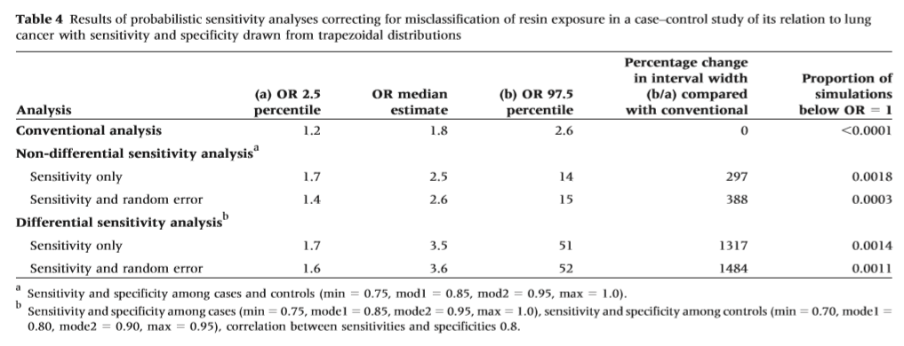
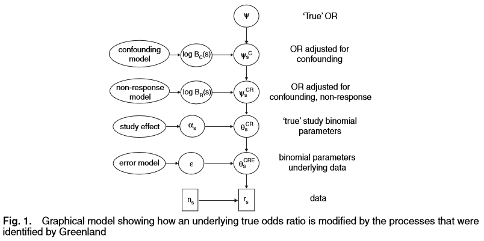
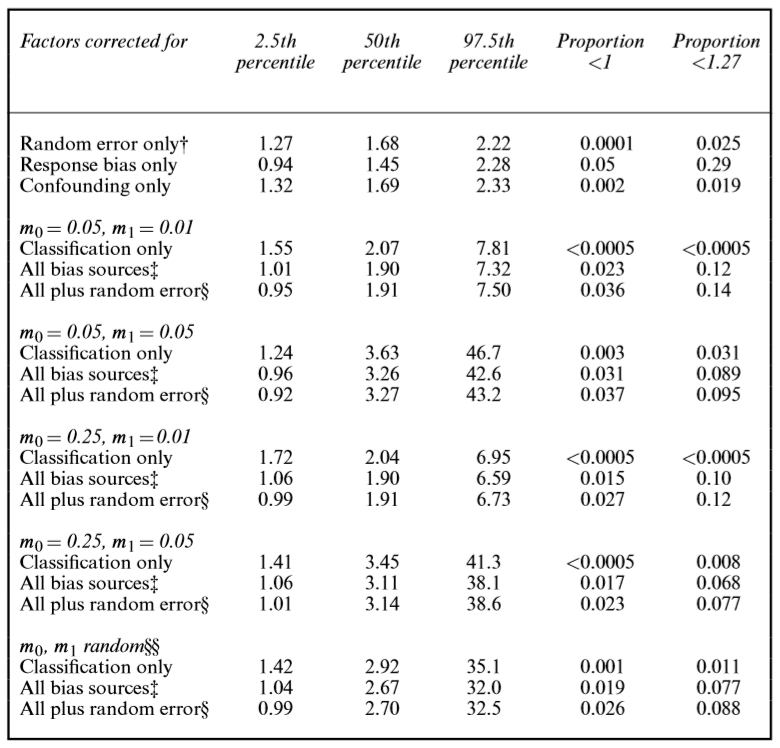
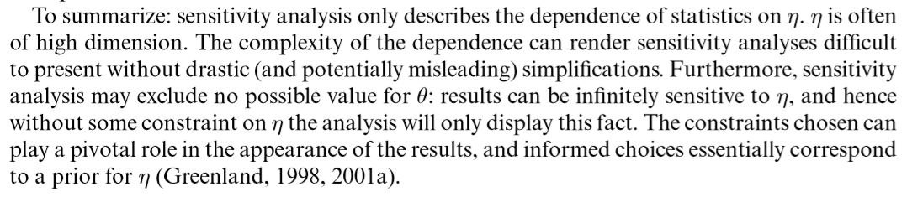
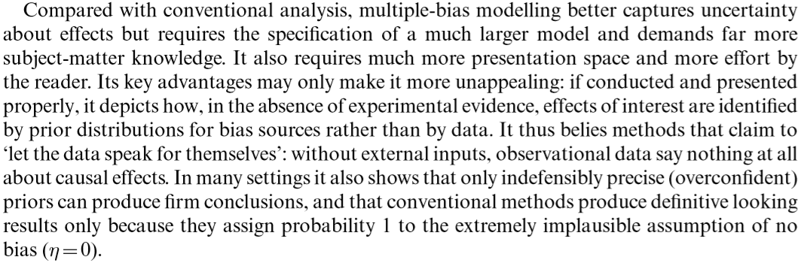
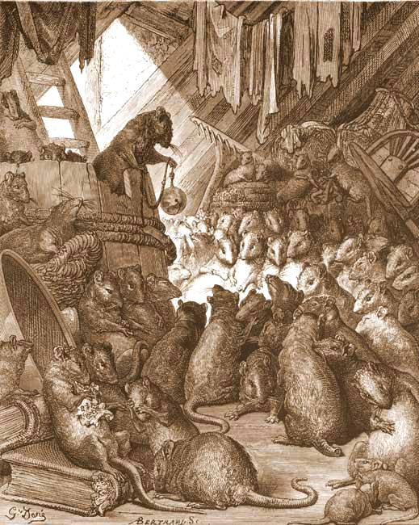

```{r setup, include=FALSE}
options(htmltools.dir.version = FALSE)
library(DiagrammeR)
library(ggplot2)
library(knitr)
opts_chunk$set(echo = FALSE, fig.width = 10, fig.height = 10 * .618)

```

class: inverse

- Introductions
- New Methods club, more focus on statistical literature
- Goal is to critically read and understand the literature on a class of methods
- Improve ability to "explore the solution space"
- Upcoming meetings: 
    - November 14, Qualitative Interactions
    - December 12, Causal inference in observational studies (TMLE)


---

class: inverse, center, middle

# Bayesian Statistical Inference

---

# Exercise

I have a coin, and I flipped it three times. The results are:

1. Head
2. Head
3. Head


**What is the probability of getting a head on the next coin flip?**


---

# Answers

Some reasonable estimates: 

1. 0.5
2. 1.0
3. Something else? 


---

# Inference

Those of you who answered 0.5 used your prior knowledge about coins to make an inference. The data from a small sample of 3 flips did not affect your prior beliefs very much. 

Those of you who answered 1.0 used the Maximum Likelihood Estimate (MLE). 

Suppose the probability of a head is a fixed value $\alpha$, the unknown parameter, and $X$ is the observed number of heads out of $n$ flips. 

The likelihood: 

$$
L(X, \alpha) = \binom{n}{X} \alpha^X (1 - \alpha)^{n - X}.
$$


With $X = n = 3$ we have $L(X, \alpha) \propto \alpha^3$. This is maximized with respect to $\alpha$ at $\hat{\alpha} = 1$. 

In general, the MLE is $X / n$.

How do we incorporate prior information? 

---

# The Bayesian Paradigm

- Instead of $\alpha$ being fixed and unknown, suppose it is a random variable $\Theta$ generated according to a _prior distribution_ $p(\alpha)$. 
- Then given (conditional on) $\Theta = \alpha$, the data $X$ are generated according to a distribution $p(x; \alpha)$ (the _likelihood_). 
- This gives the _joint distribution_ $P(X = x, \Theta = \alpha)$. 
- The analyst is interested in the distribution of $\Theta$ given the observed data, the _posterior distribution_: 

$$
P(\Theta = \alpha | X = x) = \frac{P(X = x, \Theta = \alpha)}{P(X = x)} = \frac{P(X = x | \Theta = \alpha) P(\Theta = \alpha)}{P(X = x)}. 
$$

Bayes' Rule, (1763), Thomas Bayes (1702 - 1761).

---


# Incorporating prior knowledge

Recipe: 

1. Assume a likelihood for the data given the parameters of interest (and other nuisance parameters)
2. Specify prior distributions for the parameters
3. Compute the posterior

Back to the example, we observe $X$ heads out of $X$ flips. Goal is to estimate the probability that the coin is fair. 

What is a reasonable prior distribution for $\alpha$?

Maybe, assume the coin is fair with some probability $p_{fair}$, and has 2 heads with probability $1 - p_{fair}$. 

```{r bayes}

poster <- function(n, p.fair) {
    
    denom <- .5 ^ n * p.fair + 1 * (1 - p.fair)
    
    (.5 ^ n * p.fair) / denom
    
}


```

---

# Compute!

The denominator is 

$$P(X = x) = \sum_\alpha P(X = x | \Theta = \alpha) P(\Theta = \alpha) = .5 ^ x * p_{fair} + 1 * (1 - p_{fair})$$

If $\alpha = 0.5$, the numerator is $.5^x * p_{fair}$, if $\alpha = 1$ it is $(1 - p_{fair})$. 

Thus the posterior distribution for various values of $p_{fair}$ is: 

```{r bayes2}
res <- t(sapply(c(.9, .95, .99, .999), function(x){ 
    inp <- poster(3, x)
    c(inp, 1 - inp)
    }))
colnames(res) <- c("P(a = .5 given X = 3)", "P(a = 1 given X = 3)")
res <- cbind(prior.fair = c(.9, .95, .99, .999), res)

kable(res, digits = 3, format = "html", row.names = FALSE)
```

---

# Data + prior

```{r plot}
df2 <- expand.grid(prior.fair = c(.9, .95, .99, .999, 1), X = seq(3, 20, by = 1))
df2$Posterior.fair <- with(df2, poster(X, prior.fair))

ggplot(df2, aes(x = X, y = Posterior.fair, color = factor(prior.fair))) + geom_point() + geom_line()
```

---

# What have we learned?

- How to incorporate prior beliefs or uncertainty about parameters into an analysis. 

## What does this have to do with sensitivity analysis? 

- Think about potential sources of bias as unknown parameters
- Specify prior distributions for those parameters
- Compute! (and then see what happens to your estimates of interest)

---

class: inverse, center, middle

# Sensitivity Analysis

---

# Greenland's view of conventional statistical analysis

**"The goal is to make inference on a target parameter $\theta(\alpha)$ of a population distribution parameterized by $\alpha$ using an observed data array $A$."**

e.g., difference in means, relative risk, odds ratio, hazard ratio, ... 

**"Employ a model $L(A; \alpha)$ ... and some background assumptions ..."**

e.g., no measurement error, no unmeasured confounding, random sampling of units, no misclassification

**".. to ensure identification of $\theta$ from $A$"**

"address possible violations of [the assumptions] with speculative discussions of how each might have biased the statistical results."

---

# Greenland's proposed solution

1. The effects of bias sources may be modelled by making assumptions about their operation on $L$ and incorporating a bias parameter vector $\eta$
2. This gives us $L(A; \alpha, \eta)$, but $\eta$ is not identified from $A$ and neither is $\alpha$.
3. For a fixed value of $\eta$, we can maximize $L$ with respect to $\alpha$ like usual. 
4. Specify a distribution for $\eta$ using prior knowledge and beliefs, $p(\eta)$.

Then: 
5. Calculate the posterior distribution for $\theta | A$ marginalizing over $\eta$. 

Or:
5. Draw a value $\eta^*$ from $p(\eta)$, compute MLE at this value: $\hat{\theta}_{\eta^*}$
6. Repeat step 5 many times to get a distribution of $\hat{\theta}_{\eta}$. 
7. Summarize how $\hat{\theta}_{\eta}$ varies with $\eta$. 


---

class: inverse, center, middle

# Simple examples


---

# Rosenbaum 2005

- The target parameter is the Wilcoxon signed rank test to compare two matched groups each with $S$ subjects: lead concentration in blood measured children whose fathers worked in a battery factors compared to matched (age, neighborhood) comparators whose fathers did not. 
- Bias parameter is called $\Gamma$ = odds ratio of exposure to battery dads comparing two groups who have the same age and neighborhood, but differ in an unobserved covariate

Ignoring bias, the test statistic under the null has a normal distribution with mean $S(S+1) / 4$. **This is $L(A; \alpha)$**

Allowing for bias, the statistic under the null is bounded between two normals with means 

$$
\frac{\Gamma}{1 + \Gamma} \frac{S (S + 1)}{2} \mbox{ and } \frac{1}{1 + \Gamma} \frac{S (S + 1)}{2}. 
$$

This is $L(A; \alpha, \eta)$

Thus for any $\Gamma$ we can compute a range of possible p-values. 

---

# Results

```{r tba}
dbp <- data.frame(Gamma = c(1, 2, 3, 4, 4.25, 5), min.p = rep("<0.0001", 6), max.p = c("<0.0001", 0.0018, 0.0136, 0.0388, 0.0468, 0.0740))
kable(dbp, format = "html")
```

---

# Aside

Much of the literature on sensitivity analysis before 2000 was devoted to analyzing specific models and deriving theoretical bounds like this. 


Rosenbaum has about 40 papers on the topic. 

---

# Fox et al. 2005


- This paper is concerned with analyses involving a binary exposure and binary outcome, allowing for adjustment for continuous or binary variables. 
- Bias due to misclassification of a binary variable (either exposure or outcome)
- The bias is parameterized as $\eta = (PPV, NPV)$, i.e., P(truly exposed | measured exposed), P(truly unexposed | measured unexposed). 

Most of the paper is about how to compute! under this model. 

---

# Worked Example

Let $A = (Y, X, C)$, $Y$ binary outcome, $X$ binary exposure, $C$ vector of covariates. Here we are concerned with misclassification of $X$, so let $X^*$ denote the true, unobserved value of the exposure.

Model is 

$$
Y \sim \mbox{Bernoulli}(p), logit(p) = \beta_0 + \beta_1 X^* + \beta_c C,  
$$

where $X^* \sim \mbox{Bernoulli}(PPV_Y)$ if $X = 1$ and $X^* \sim \mbox{Bernoulli}(NPV_Y)$ if $X = 0$.

Notes: 

- Model is for the true, unobserved exposure
- Probabilities of correct classification are allowed to depend on $Y$ (differential misclassification)
- Still need priors for those probabilities

---

- Specify a range of plausible values for senstivity and specificity
     - Uniform, independent
     - Trapezoidal, correlated
- Use Bayes' Rule (!) to back transform to PPV/NPV (or specify those directly)

### Compute!

For each of many iterations: 

1. Sample values of $PPV_Y$ and $NPV_Y$ from the specified priors
2. For each subject in the sample: 
    1. Determine their P(missclassification) according to observed values of $X$ and $Y$
    2. Sample a random binary variable according to P(missclassification)
    3. If variable is 1, swap their value from 0 to 1 or 1 to 0
3. Run the analysis to get $\hat{\beta_1}$ and its standard error
4. Sample a random normal variable with mean 0 and sd = standard error from 3. 
5. Add $\hat{\beta_1}$ to that sample in 4.

The result is a series of estimates of the target parameter. 


---

# Summary




---

# Test your understanding

- Where are the sources of variation in the distribution of $\hat{\beta_1}$?
- Was this approach a Bayesian analysis? 
- Can you think of other possible ways to parameterize the bias model?
- How would you incorporate an analysis of other sources of bias (unmeasured confounding, say)?


---

# Greenland, section 3

Does exposure to magnetic fields cause childhood leukemia?

Data from 14 studies $S$ include number exposed to more than some level of magnetic field $X$, number of leukemia cases $Y$, and some study-level covariates type of measurement and type of electricity system in the country. 

The target parameter is the odds ratio for the causal effect of magnetic field exposure on leukemia in the population. 

Mantel–Haenszel analysis produces an estimated odds ratio for the field–leukaemia association of 1.68, with 95% confidence limits of (1.27, 2.22).

Greenland proceeds to model the effect of bias due to 

1. Misclassification of the exposure
2. Non-response (members of population sampled but didn't participate)
3. Unmeasured confounding

---

# Misclassification

Denote the true exposure $T$. How does Greenland specify the relationship between $T$ and $X$? 

--

Error rates: $\epsilon_x = P(X = x | T = t)$, i.e., sensitivity and specificity. With bounds based on the observed proportions exposed.

Further, allow the error rates to depend on study, and study-level covariates (equation 5)

---

# Non-response

The response rate $R(t, y, s)$ is the probability of being part of the study that a member of the population with values $T = t, Y = y, S = s$ who is sampled for inclusion in the study. 

He computes the biasing factor due to non-response in equation 7 that is applied to the sample odds ratio. I.e., population odds ratio = sample odds ratio times biasing factor. 

Then, allow that biasing factor to depend on covariates at the study level. 


---

# Unmeasured confounding

The biasing factor due to a single binary unmeasured confounder depends on three things: 

- The population odds of the confounder $U$ being present
- The $T$ - $U$ association
- The $U$ - $Y$ association

Again, allow these things to depend on study and study level covariates. 


---

# Putting it all together

He views these as a series of corrections that are applied sequentially: 

- Sample $TY$ odds ratio: $\omega_{TY} = G_m(A, \epsilon_0, \epsilon_1)$
- Population odds ratio: $\Omega_{TY} = \omega_{TY} / B_R$
- Causal population odds ratio: $\Omega_{TY} / B_C$

i.e. we get the equation on page 284. 

Corrections 2 and 3 are commutative, it doesn't matter in which order we apply them. In general, see section 2.5. 

---



---

# More details

Each of these correction factors depend on a bunch of unknown paramters. 

For this to work, 

1. Use the priors on all those parameters to sample draws
2. Calculate the correction factors given 1
3. Compute! the odds ratio and standard error


Result is a series of samples from the posterior distribution of the target parameter (approximately), that accounts for both random error and bias.

---


# Results




---

class: inverse, center, middle

# Interpretation?

---

# "Conventional" sensitivity analysis

- "since restricting to new initiators of statins only (rather than prevalent and new initiators) can be a sensitivity analysis."
- “In a sensitivity analysis of all incident cases during 2002-2003 (supposed to be true incident cases), we checked..."
- "How about adding the following results restricted to cases with <2 years between first and second IBD listing as a sensitivity analysis"
- "could one perform a sensitivity analysis where we assume that a certain number of visits before the first PD visit are actually part of the PD visit (say 1-5)?"

### Can we interpret these sort of analyses in terms of concepts we've discussed today?

--

"Obtain another estimate of the target parameter without explicity extending the model to incorporate bias, under a fixed value of the bias parameter that is unknown." 

---

# Commentary on Greenland



- Greenland himself

---

# Difficulties



- Greenland again

---

# Usage

> Multiple-bias modelling can be superfluous when conventional standard errors make clear that substantive inferences are unwarranted. It may, however, be essential when an analysis purports to draw causal inferences from observational data, when bias uncertainty is comparable with random error or when decisions with costly consequences must be made on the basis of the available evidence.

---


.pull-left[
# Conclusion

- Has Greenland "belled a nasty cat"? 
- We often think about the possibility of errors
- Now we can write down what they are and model them using computational and/or theoretical tools
- Is it impossibly difficult?
]
.pull-right[


https://en.wikipedia.org/wiki/Belling_the_Cat
]