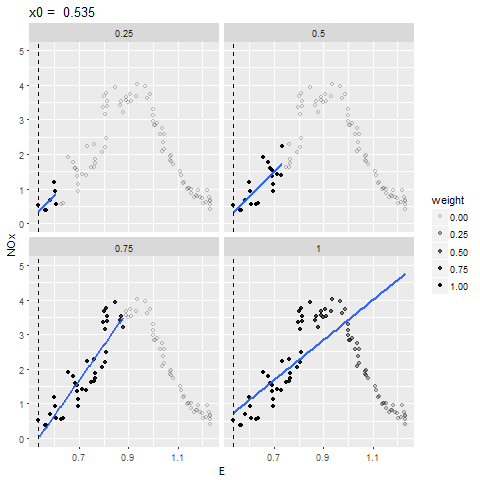
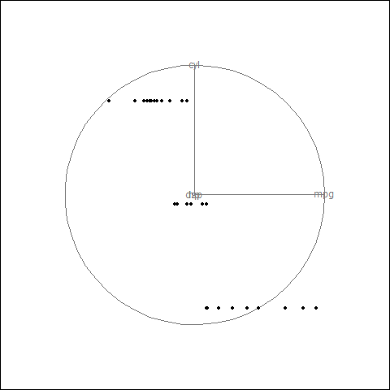
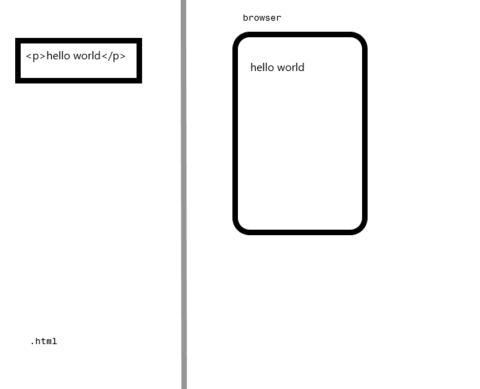
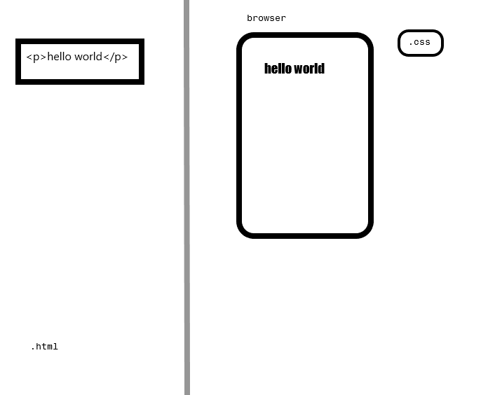
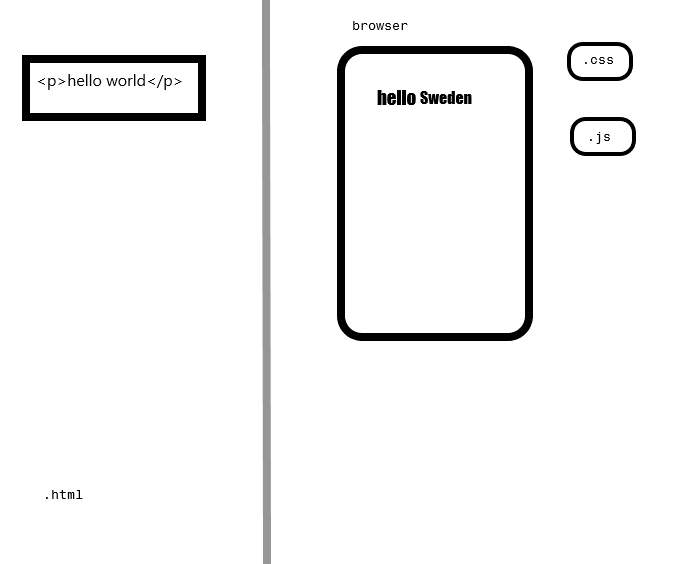
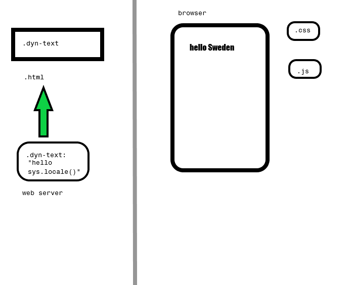

```{r setup, include=FALSE}
knitr::opts_chunk$set(echo = FALSE)
```


# What are they?

```{r init, include = FALSE}
library(lattice)
library(ggplot2)
#library(gganimate)
library(broom)
library(gridSVG)
library(grid)
library(survival)
library(dplyr)
library(gapminder)
library(plotROC)
library(gginteractive)
```


## Interactive graphics

- Allow user to interact with graphical elements
- Clicks, drags, controls, etc.
- Animation

[gapminder](http://www.gapminder.org/tools/#_state_time_delay:100;;&chart-type=bubbles)


# Why use them?

## Compared to static figures/tables

- Increase density of information
- Enhance dimensionality of a figure
- Facilitate access to information


## Illustrate concepts

```{r, eval = FALSE}
spans <- c(.25, .5, .75, 1)

data(ethanol)
# create loess fits, one for each span
fits <- data_frame(span = spans) %>%
  group_by(span) %>%
  do(augment(loess(NOx ~ E, ethanol, degree = 1, span = .$span)))

# calculate weights to reproduce this with local weighted fits
dat <- ethanol %>%
  inflate(span = spans, center = unique(ethanol$E)) %>%
  mutate(dist = abs(E - center)) %>%
  filter(rank(dist) / n() <= span) %>%
  mutate(weight = (1 - (dist / max(dist)) ^ 3) ^ 3)

# create faceted plot with changing points, local linear fits, and vertical lines,
# and constant hollow points and loess fit
p <- ggplot(dat, aes(E, NOx)) +
  geom_point(aes(alpha = weight, frame = center)) +
  geom_smooth(aes(group = center, frame = center, weight = weight), method = "lm", se = FALSE) +
  geom_vline(aes(xintercept = center, frame = center), lty = 2) +
  geom_point(shape = 1, data = ethanol, alpha = .25) +
  geom_line(aes(y = .fitted, frame = E, cumulative = TRUE), data = fits, color = "red") +
  facet_wrap(~span) +
  ylim(0, 5) +
  ggtitle("x0 = ")

ani.options(convert = "C:/Users/micsac/convert.exe")
gganimate(p, file = "C:/Users/micsac/test.gif", interval = .2)
```





## Reduced cognitive burden

- A geometric element that represents a data point can be tracked visually through a transition
- Pre-attentive processing of motion > scanning + matching of labels/colors

$\rightarrow$ enhances viewer's understanding + insight

## Static gapminder is hard to absorb

```{r g1}
ggplot(gapminder, aes(x = gdpPercap, y = lifeExp, color = continent, size = pop)) +
   geom_point()  + scale_x_log10() + facet_wrap(~ year)
```


## Information density/access

- Answer many questions at once
- Empower users to find information
- Not being reactive to "what if?s"
- Reduce burden on statisitician


## Explore data




## Enhance standard graphs

```{r rocex, include = FALSE}
set.seed(2529)
library(plotROC)

D.ex <- rbinom(200, size = 1, prob = .5)
M1 <- rnorm(200, mean = D.ex, sd = .65)
M2 <- rnorm(200, mean = D.ex, sd = 1.5)

test <- data.frame(D = D.ex, D.str = c("Healthy", "Ill")[D.ex + 1], 
                   M1 = M1, M2 = M2, stringsAsFactors = FALSE)

```


```{r roccd, results = "asis"}


p1 <- ggplot(test, aes(d = D, m = M1)) + geom_roc()
cat(export_interactive_roc(p1, 
                        prefix = "a"))
```


## Static version

```{r roccd2}
p1 + geom_rocci() + style_roc()
```


# Where do we view them? 


## Web browser

- Cross platform and portable/easy to share
- Lots of existing infrastructure and tools


## Servers and browsers

A static web page




## Servers and browsers (2)

A static web page




## Servers and browsers (3)

A static web page




## Servers and browsers

A dynamic web page



## SVG

"Scalable Vector Graphics"

A standardized markup format for describing shapes: 


# How do we make them?


## Rendering

```{r, echo = FALSE, fig.width = 4, fig.height = 4, fig.align = "left"}
mtcars %>% select(mpg, hp) %>% head(1) %>% ggplot(aes(mpg, hp)) + geom_point(size = 5) + 
  scale_x_continuous("", labels = NULL) + scale_y_continuous("", labels = NULL) + theme_minimal()
```

```
<symbol id="gridSVG.pch19" viewBox="-5 -5 10 10" overflow="visible">
          <circle cx="0" cy="0" r="3.75"/>
</symbol>
```

## Modify rendered elements

<div class="centered">

```{r, echo = FALSE, fig.width = 2, fig.height = 2, fig.keep='none', results = 'asis', fig.align = "center"}
pexsm <- mtcars %>% select(mpg, hp) %>% head(1) %>% ggplot(aes(mpg, hp)) + geom_point(size = 5) + 
    scale_x_continuous("", labels = NULL) + scale_y_continuous("", labels = NULL) + theme_minimal()
pexsm
grid::grid.force()
tnm <- gridSVG::grid.export(NULL)
nme <- grep("points", names(tnm$mappings$grobs), value = TRUE)

tnm$svg


```

</div>

```js
d3.select("gridSVG.pch19")
  .move(Math.random());
```


<script type="text/javascript">

var thispt = d3.select("[id^='`r noquote(nme)`.1.1']")

var curx = thispt.attr("x")
var cury = thispt.attr("y")
var count = 1

var move1 = setInterval(function(){
	
	if(count >= 10){
	    thispt.transition().duration(100)
	    .attr("x", curx)
	    .attr("y", cury);
		count = 1;
	} else {
	
  thispt.transition().duration(500)
  .attr("x", 210 + (.5 - Math.random()) * 200)
  .attr("y", 210 + (.5 - Math.random()) * 200);
 	count++
}
}, 1000);

</script>


## Data Driven Documents

[d3js.org](https://d3js.org)

- Rendered objects in the web browser, text, svg, etc. 
- Manipulate visual elements with JavaScript in response to changes in data
- Abstract and powerful
- Data first!

A number of toolkits have spun off based on d3.js

- [vega](https://vega.github.io/vega/)
- [nvd3](http://nvd3.org/)
- [plotly](https://plot.ly/)

### Manage data in R, send it to a toolkit to do the work

## Shiny

[shiny.rstudio.com](https://shiny.rstudio.com)

- R code running on a server
- Organize interfaces to R objects in a browser
- R then updates plots/tables/analyses
- "Reactive" programming

### Let R do all the work, display in it a browser

## My approach

- R+ggplot2 generates nice svg
- Develop extensions to manipulate that svg in the browser
- ... a more general framework, e.g., extend the grammar to interactivity


```{r test-a, echo = FALSE, fig.keep='none', results = 'asis', fig.width=3.25, fig.height=2}
p <- ggplot(mtcars, aes(x = mpg, y = hp)) + geom_point(size = 2) + 
  scale_y_continuous(limits = c(-50, 500)) + scale_x_continuous(limits = c(0, 50))
p

grid.force()
## grid.ls()  find the name of the points grob
tmm2 <- grid.export(NULL, prefix = "cars")
nme2 <- grep("points", names(tmm2$mappings$grobs), value = TRUE)
tmm2$svg
```

<button id="moveme">Move the points!</button>
  
  <script>
  
  function randCol() {
    
    return "rgb(" + Math.round(Math.random()*255) + ", " + Math.round(Math.random()*255) + ", " + Math.round(Math.random()*255) + ")";
    
  } 

d3.select("#moveme").on("click", function(){
  
  d3.selectAll("[id^='cars`r noquote(nme2)`.1.']")
  .transition().duration(500)
  .attr("fill", randCol())
  .attr("y", function(d){ return Number(d3.select(this).attr("y")) + 50 * (Math.random() - .5); })
  .attr("x", function(d){ return Number(d3.select(this).attr("x")) + 25 * (Math.random() - .5); });
  
});
</script>


## Examples (1)


```{r rocode, echo = TRUE, results = "asis"}
library(plotROC)

p1 <- ggplot(test, aes(d = D, m = M1)) + geom_roc()
cat(export_interactive_roc(p1, 
                        prefix = "b", omit.js = TRUE))
```


## Examples (2) 


```{r ggint, echo = TRUE, results = "asis", fig.width = 3, fig.height = 1.5, omit.js = TRUE}
library(gginteractive)

spans <- seq(.3, 1.5, by = .1)
p4 <- ggplot(mtcars, aes(x = wt, y = mpg)) +
  geom_point(size = 2) +
  lapply(spans, function(x) geom_smooth(method = "loess", span = x, se = FALSE))

controls <- 0:length(spans)
names(controls) <- c("none", spans)
p4 %>% mesh_geom("smooth", attr = "opacity",
                 control = radio(controls))
```

## Examples (3) 

```{r gap1, echo = TRUE, results = "asis", fig.width = 3.25, fig.height = 1.5, omit.js = TRUE}
p2 <- ggplot(gapminder, aes(x = gdpPercap, y = lifeExp, color = continent, size = pop)) +
         geom_point()  + scale_x_log10() 

p2 <- p2 %>% mesh_alpha(geom = "point", variable = "year", on = radio0)
p2
```


## Examples (4)


```{r test-km, fig.keep='none', results = 'asis', warning = FALSE, message = FALSE, echo = FALSE, fig.width=4, fig.height=2}
library(ggkm)
gdat <- survival::lung
fit <- survfit(Surv(time, status) ~ factor(sex), data = gdat)
tdat <- with(fit, data.frame(n.risk, time, surv, strata = rep(1:2, strata)))
targ.times <- seq(min(tdat$time), max(tdat$time), by = 15)[-c(1, 68)]

interp <- function(dat, t){
  
  if(t %in% dat$time){
    
    return(dat[dat$time == t, ])
    
  } else {
    
    t2 <- max(dat$time[dat$time < t])
    
    d2 <- dat[dat$time == t2, ]
    d2$time <- t
    return(d2)
    
  }
  
}

tdat2 <- NULL
for(ttt in targ.times){
  
  tdat2 <- rbind(tdat2, tdat %>% group_by(strata) %>% do({
    
    interp(., ttt)
    
  }))
}
tdat <- tdat2[order(tdat2$strata, tdat2$time),]

p1 <- ggplot(gdat, aes(time = time, status = status, color = factor(sex))) + geom_km()

p1 + geom_text(data = tdat, aes(x = time, y = surv, label = n.risk, hjust = .5, vjust = -1,
                                status = NULL, color = NULL), alpha = 0) + 
  geom_point(data = tdat, aes(x = time, y = surv,
                              status = NULL, color = NULL), alpha = 0)

grid.force()
lsg <- grep("geom_point.points.", grid.ls(print = FALSE)$name, value = TRUE)

grid.garnish(lsg, tip = paste(tdat$n.risk), group = FALSE, global = FALSE, grep = TRUE)
kmon <- grid.export(NULL, prefix = "km", strict = FALSE)
kmnne <- grep("geom_point.points", names(kmon$mappings$grobs), value = TRUE)
kmon$svg
```

<script type="text/javascript">
 // extract data from points to bind
 var pdata = [];

  d3.selectAll("[id^='km`r noquote(kmnne)`.']").each(function(d, i){

	me = d3.select(this);
	pdata.push({"x": me.attr("x"),
				  "y": me.attr("y"),
				  "nrisk": me.attr("tip")});

  })


  var times = [];
  for(var i = 1; i < pdata.length; i++){
  

    if(i == pdata.length - 1){
      var wd = Math.max(0, pdata[i].x - pdata[i-1].x);
    } else {
      var wd = Math.max(0, pdata[i + 1].x - pdata[i].x);
    }

    var dots = [];
    for(var j = 0; j < pdata.length; j++){
      if(pdata[j].x == pdata[i].x){
        dots.push({"px": pdata[j].x,
        "py": pdata[j].y,
        "nrisk": pdata[j].nrisk});
      }
    }

    times.push({"xtran": pdata[i].x,
              "width": wd,
              "dots": dots});
  }


var svg = d3.select("g#kmgridSVG");

var rects = svg.append("g").attr("class", "rects").selectAll("g");

var rectEnter = rects.data(times).enter().append("g");

  rectEnter.append("rect").attr("class", "tess").attr("transform", function(d) { return "translate(" + d.xtran + ", 0)"; })
  .attr("width", function(d) { return d.width; })
  .attr("height", 720);

  var dotEnter = rectEnter.selectAll("circle").data(function(d){ return d.dots; }).enter();

  dotEnter.append("circle").attr("class", "dot")
.attr("r", 3.5)
.attr("cx", function(d) { return d.px; })
.attr("cy", function(d) { return d.py; });

dotEnter.append("g")
   .attr("transform", function(d){ return "translate(" + (d.px+20) + ", " + d.py + ")"; } )
    .append("text").attr("class", "hidetext").attr("transform", "scale(1, -1)").attr("dy", "-15px")
    .text(function(d) { return "n.risk: " + Math.round(d.nrisk*10)/10;  });


</script>

# Conclusion

## Summary

### What

- Interactive statistical graphics

### Where 

- Use is widespread in blogs/webpages, but only emerging in scientific publishing (e.g., Elsevier)

### Why

- Animation/interactivity should only be used when it enhances understanding

Interesting applications:

- Summarizing complex data analysis
- Illustrating statistical concepts
- Let collaborators play the what-if? game

### How

- Link to JavaScript libraries
- Rendering in R, get interactivity for free
- Shiny server 


## Advice

For making your own interactive figures:

### How do you plan to share?

- Making and sharing static web sites is easy
- Running code on a server requires a lot more IT tasks

### What is the end product? 

- Print article? Spend lots of time getting the static figure right -> enhance with some interactivity
- Fancy report for collaborator
- Public-facing website

### There are many tools out there, find the right one that fits your needs


