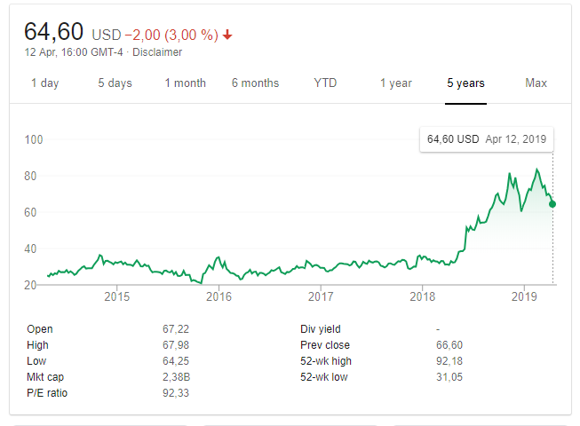
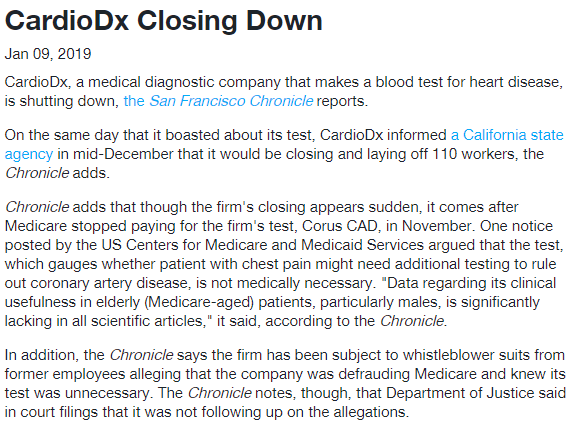
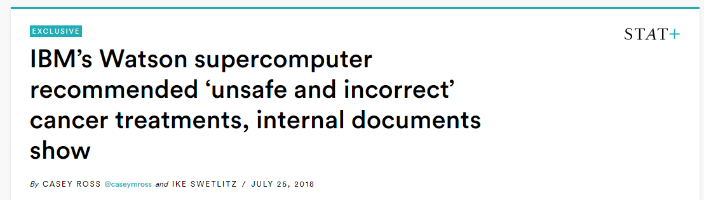

```{r setup, include=FALSE}
options(htmltools.dir.version = FALSE)
knitr::opts_chunk$set(echo = FALSE, message = FALSE, warning = FALSE, 
                      fig.width = 10, fig.height = 10 * .618,
                      fig.align = 'center')
library(ggplot2)
library(gridExtra)
library(plotROC)
library(dplyr)
library(igraph)


theme_set(theme_bw())# + theme(plot.background = element_rect(fill = "#999999")))

```


background-image: url(https://venturebeat.com/wp-content/uploads/2013/10/big-data-sea.jpg)
class: center

# Prologue

---

# Demystifying some jargon

**Machine learning, neural networks, deep learning, ..., oh my**

- All of these refer to classes of algorithms that take training data and output models for generating predictions
- They may be distinguised from statistical models because they do not necessarily imply probability models for the data
    - Do not model the data generating process but rather attempts to learn from the dataset at hand
    - Do not yield interpretable estimates of associations (which variables are important)
- The algorithms are generally flexible, allowing interactions and non-linearities

Artifical intelligence is a bit nebulous, but it can be distinguished from ML by considering that intelligence is characterized by the demonstration or application of knowledge to perform an action, e.g., perceive an image, make a decision, change direction, ... 

---

class: inverse, middle

# So you want to use machine learning

"I've heard about machine learning and I don't want to miss out, can you help me apply it to my data?"


---

# Wrong!

The goal of medical studies is to produce the evidence that can be used to

- Diagnose disease
- Identify risk factors for disease
- Treat disease
- Prognosticate
- Prevention of disease
- Improve understanding of basic science

**Start with a hypothesis!**

---

ML is a suite of tools for prediction, i.e., can I predict future/unobserved values of Y using X? 

What is the intended use of the predictions? 

- Implement a new policy or screening program on a population level
- Guide treatments for individual patients
- Allocate funds/time for further research and development?

**A prediction by itself is not clinically useful unless it leads to an action**


---

# Rich Simon on black box prognostic models

"There is an **enormous gap between the large literature on prognostic models and the small number of models used in medical practice**. There are several reasons for this discrepancy. **Most prognostic models do not provide actionable information.** That is, they are based on analysis of a heterogeneous set of patients who received a variety of treatments. **Physicians want tools that help them make treatment decisions.** Unless that decision context is clearly and specifically defined at the outset of the study and used to drive the selection of the training set, the resulting model is unlikely to find medical acceptance."

---


class: inverse, middle

# Formal decision analysis

How do we incorporate predictions into decision making?

---

# A simple decision tree

```{r, fig.width = 9, fig.height = 5}
G <- graph.tree(n=7,children=2)

#add names to vertex (just assign a upper-case letter to each)
V(G)$name <- c("Home", "Outside", "Outside", "dry and burden", "dry and burden", "wet and no burden", "dry and no burden")
E(G)$name <- c("raincoat", "no raincoat", "rain", "no rain", "rain", "no rain")

# plot (1)
lay <- layout.reingold.tilford(G, params=list(root='Home')) 
par(mar = c(0, 0, 0, 0) + .1)
plot(G, layout=-lay[, 2:1], vertex.shape="none", edge.label = E(G)$name, edge.label.color = "black", cex = .85)
```

---

# Incorporating probabilities and utilities

```{r,  fig.width = 9, fig.height = 5}
G <- graph.tree(n=7,children=2)

#add names to vertex (just assign a upper-case letter to each)
V(G)$name <- c("Home", "Outside", "Outside", "dry and burden (-10)", "dry and burden (-10)", "wet and no burden (-100)", "dry and no burden (0)")
E(G)$name <- c("raincoat (Pr=0.5)", "no raincoat (Pr=0.5)", "rain (0.5)", "no rain (0.5)", "rain (0.5)", "no rain (0.5)")

# plot (1)
lay <- layout.reingold.tilford(G, params=list(root='Home')) 
par(mar = c(0, 0, 0, 0) + .1)
plot(G, layout=-lay[, 2:1], vertex.shape="none", edge.label = E(G)$name, edge.label.color = "black", cex = .85)

```
---


# Incorporating a prediction

```{r util2, fig.width = 9, fig.height = 5}
G2 <- graph.tree(n=15,children=2)

#add names to vertex (just assign a upper-case letter to each)
V(G2)$name <- c("Predict (-5)", "|", "|", "Outside", "Outside", "Outside", "Outside", 
                "dry and burden (-10)", "dry and burden (-10)", "wet and no burden (-100)", "dry and no burden (0)", 
                "dry and burden (-10)", "dry and burden (-10)", "wet and no burden (-100)", "dry and no burden (0)")
Enames <- c("low chance (Pr=0.5)", "high chance (0.5)", "no raincoat", "raincoat", "rain (0.1)", "no rain (0.9)", "rain (0.9)", "no rain (0.1)")

G3 <- delete_vertices(G2, c(4, 7, 8, 9, 14, 15))
lay <- layout.reingold.tilford(G3, params=list(root='Predict (-5)')) 
par(mar = c(0, 0, 0, 0) + .1)
plot(G3, layout=-lay[, 2:1], vertex.shape="none", edge.label = Enames, edge.label.color = "black", cex = .85)

```


---

# Analysis

Does using the prediction lead to reduced suffering, on average? 

- Utility values are personal and not easy to define, and may vary over time
- As with drugs, we don't expect predictions to benefit everyone, every time, only on averge.


---

# Challenges

1. Determining possible actions (raincoat or umbrella)
2. Development and evaluation of prediction model
3. Estimation of probabilities
    - Distribution of predictions in the population (proportion testing positive)
    - Distribution of outcomes conditional on predictions
4. Assessment of utilities

### Generate evidence to support use/no use of the model

Some biomedical examples later

---


background-image: url(https://imgs.xkcd.com/comics/machine_learning.png)
class: center

# Machine learning methods


---

# The goal

- Take training data (paired predictor-outcome), 
- Forming a function that takes only predictor data and gives you an estimated outcome
- Evaluate the quality of the function

> **Key point:** Uninformative features in the training sample may not be reflected in the population

**The only honest estimate of prediction performance is based on data NOT used to develop the signature**

- In multivariable linear regression, the in-sample R squared value (and hence MSE) will decrease with each additional variable in the model, whether that variable is noise or informative. 
- This does not imply that the model has good out-of-sample prediction


---

# The challenges

- What data
- Measuring how right the answers are
- Stirring the pile cleverly


---

# The strategy

for $X$ a set of observable covariates, the goal is to find a function $f(X)$ that is a good predictor of the outcome $Y$.

The strategy: 

1. Specify a real valued loss function $L(f(X), Y)$ that quantifies how close $f(x)$ is to $Y$. Penalize the loss for overly complex models.
2. Restrict the search to a limited class of functions:
    - Linear combinations of $X$: regression
    - Nested univariate dichotomizations of the $X$s: trees
    - Allow pairwise interactions
    - Allow polynomials, other transformations
3. Search for a good candidate $f$
    - Brute force: neural networks
    - Gradient based searches: gradient boosting
    - Average many simple searches over bootstraps: bagging
4. Combine over classes of algorithms
    - Stacking
    - Bagging (again)
    - Superlearner


---

# Learning

https://web.stanford.edu/~hastie/ElemStatLearn/

---

# Doing

- R: https://cran.r-project.org/web/views/MachineLearning.html
- SAS: https://communities.sas.com/t5/SAS-Data-Mining-and-Machine/machine-learning-using-base-SAS/td-p/139513
- Python: ...
- Weka: https://www.cs.waikato.ac.nz/~ml/weka/index.html
- H2O: https://www.h2o.ai/download/#h2o
- Ludwig: https://uber.github.io/ludwig/

#### Cloud based implementations: 
- https://www.tensorflow.org/
- https://azure.microsoft.com/en-us/services/machine-learning-service/
- https://caffe.berkeleyvision.org/
        
        
---

class: inverse, middle

# Lessons from the literature

---

# Oncotype DX

A gene expression signature used to predict breast cancer recurrence. 

The TailorX trial

```{r, fig.width = 9, fig.height = 5}
G2 <- graph.tree(n=13,children=3)

#add names to vertex (just assign a upper-case letter to each)
V(G2)$name <- c("Breast cancer", "Tx", "Randomize", "Tx", "Follow up", "Follow up",  "Follow up", "Follow up", 
                "Follow up",  "Follow up", "Follow up", "Follow up",  "Follow up")
Enames <- c("low risk of recurrence", "medium risk", "high risk", "no chemo", "chemo", "no chemo", 
            "chemo", "no chemo", "chemo", 
            "no chemo", "chemo", "no chemo")

G2 <- delete_vertices(G2, c(6:7, 10, 11, 13))
lay <- layout.reingold.tilford(G2, params=list(root='Breast cancer')) 
par(mar = c(0, 0, 0, 0) + .1)
plot(G2, layout=-lay[, 2:1], vertex.shape="none", edge.label = Enames, edge.label.color = "black", cex = .85)

```

---




---

# Corus CAD

A blood based diagnostic test for coronary artery disease. 

- Original publication reported a (biased) resubstitution estimate of the AUC
- Claims that test negatives do not need to undergo further screening, via angiogram or ultrasound

1. Does not clearly specify actions or context
2. Low benefit of test negative
3. High costs of false negatives: heart attack due to undiagnosed CAD


---




---

# IBM Watson for cancer treatment

- Billions of USD spent on global marketing
- claim that Watson for Oncology, through artificial intelligence, can sift through reams of data to generate new insights and identify, as an IBM sales rep put it, “even new approaches” to cancer care. 
- STAT found that the system doesn’t create new knowledge and is artificially intelligent only in the most rudimentary sense of the term.
- No evaluation (independent or otherwise) of whether the use of the system leads to patient benefit

The "AI" consisted of a group of doctors at MSKCC manually creating treatment recommendations

---



---

# Finn Gen cardiovascular risk

- Polygenic risk score for heart disease based on millions of loci
- Combined with basic data (Framingham score) explains about 30% of the variation

### Interesting study: 

1. Assemble a cohort in Finland
2. Estimate individual's risk score
3. Report individuals' score to them, along with information on how risk changes in reponse to actions (e.g., stop smoking, lose weight)
4. Follow them and see what happens

---

# Summary

- The barriers to doing ML are very low
- No substitute for critical scientific thinking
- Prediction models can be useful, need to clearly specify the space of actions, and assess the utility of using the model to drive actions. 
- In some cases ML might be the right tool for the job.

A simple criteria for assessing AI/ML research projects: 

Every time you see the term AI or ML, think instead of a people named Albert and Malin sitting at their computers running logstic regression models. If the project still sounds interesting/promising, then proceed. 
